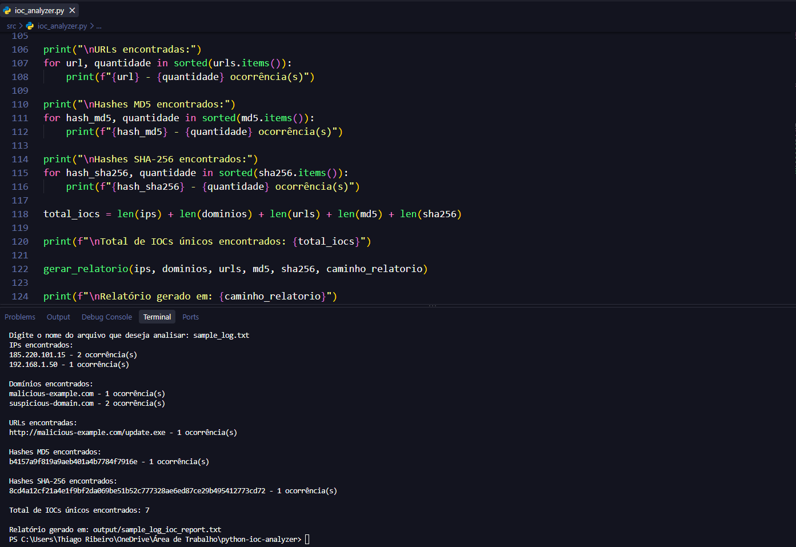
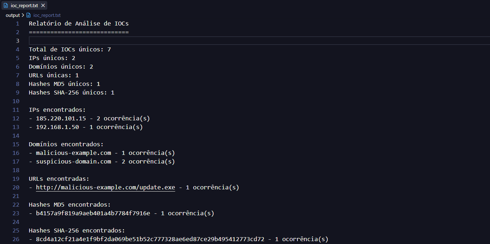

# Python IOC Analyzer

## Objetivo

Este projeto foi desenvolvido para automatizar a extração de indicadores de comprometimento (IOCs) em arquivos de log utilizando Python.

O script identifica e organiza endereços IP, domínios, URLs, hashes MD5 e SHA-256, além de remover falsos positivos simples, validar endereços IP e contabilizar a quantidade de ocorrências de cada indicador.

## Funcionalidades

- Leitura de arquivos de log
- Extração de endereços IP
- Validação de IPv4
- Extração de domínios
- Filtro básico de falsos positivos
- Extração de URLs
- Extração de hashes MD5
- Extração de hashes SHA-256
- Remoção de duplicados
- Contagem de ocorrências
- Geração automática de relatório
- Tratamento de arquivo inexistente
- Nome de relatório baseado no arquivo analisado

## Tecnologias utilizadas

- Python
- Regex
- `ipaddress`
- `collections.Counter`
- `pathlib`

## Estrutura do projeto

```
python-ioc-analyzer/
├── src/
│   └── ioc_analyzer.py
├── input/
│   └── sample_log.txt
├── output/
│   └── sample_log_ioc_report.txt
└── evidence/
    ├── evidence-01-ioc-analyzer-running.png
    └── evidence-02-ioc-report.png
```
## Funcionamento

O programa solicita o nome do arquivo que será analisado e procura o arquivo dentro da pasta `input/`.

Após a leitura, o conteúdo é analisado em busca dos padrões definidos para cada tipo de IOC.

Os resultados são validados, organizados e contabilizados antes da geração automática de um relatório dentro da pasta `output/`.

## Como executar

Coloque o arquivo de log que deseja analisar dentro da pasta `input/`.

Depois execute o script a partir da pasta principal do projeto:

```
python src/ioc_analyzer.py
```

O programa solicitará:

```
Digite o nome do arquivo que deseja analisar:
```

Exemplo:

```
sample_log.txt
```

Após a análise, o relatório será criado automaticamente dentro da pasta `output/`.
## Exemplo de execução

A imagem abaixo mostra o script analisando o arquivo `sample_log.txt` e identificando IPs, domínios, URLs e hashes.



No exemplo analisado foram encontrados `7` IOCs únicos, incluindo endereços IP, domínios, uma URL e hashes MD5 e SHA-256.

## Relatório gerado

Além de exibir os resultados no terminal, o script gera automaticamente um relatório contendo os indicadores encontrados e a quantidade de ocorrências de cada um.



Um exemplo do relatório está disponível em:

[`output/sample_log_ioc_report.txt`](output/sample_log_ioc_report.txt)

## Conceitos praticados

Durante o desenvolvimento deste projeto foram utilizados conceitos de Python aplicados à automação de tarefas de análise de segurança, incluindo:

- Manipulação de arquivos
- Variáveis e estruturas de dados
- Funções
- Laços `for`
- Estruturas condicionais
- Tratamento de exceções
- Expressões regulares (Regex)
- Validação de endereços IP
- Uso de `Counter`
- Manipulação de caminhos com `Path`
- Geração automática de relatórios

## Aplicação em SOC

Em um ambiente de SOC, logs e outras fontes de dados podem conter grandes quantidades de indicadores que precisam ser identificados durante uma investigação.

Este projeto demonstra uma forma simples de automatizar parte desse processo, permitindo extrair e organizar IOCs para auxiliar etapas posteriores de análise e enriquecimento.
